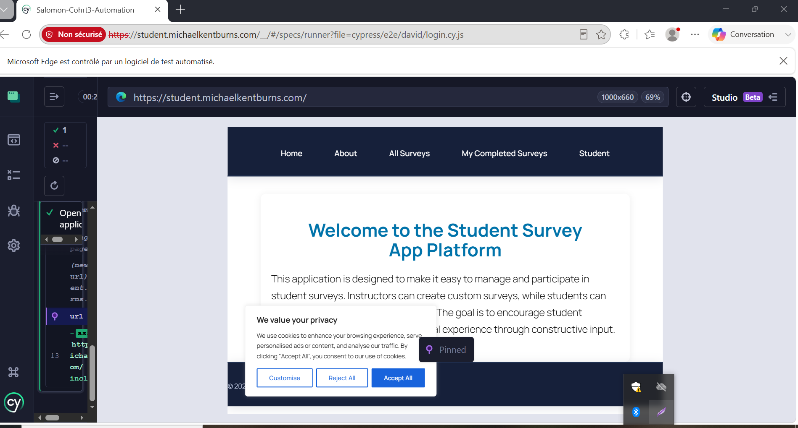
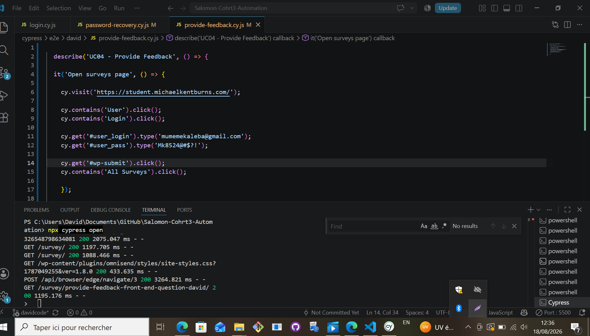
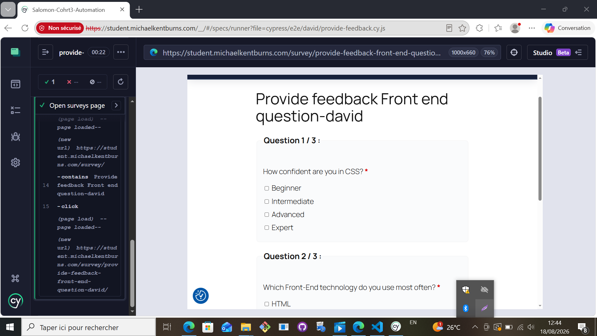
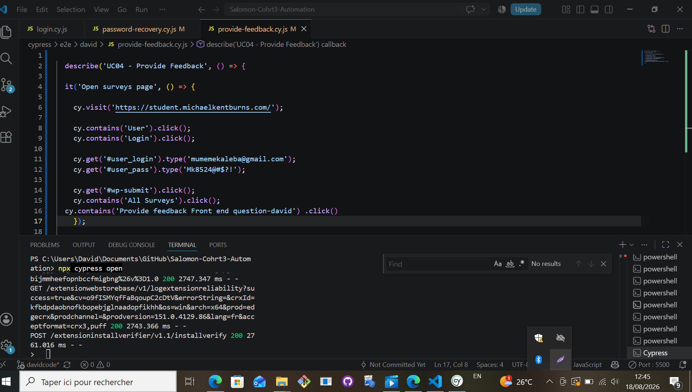
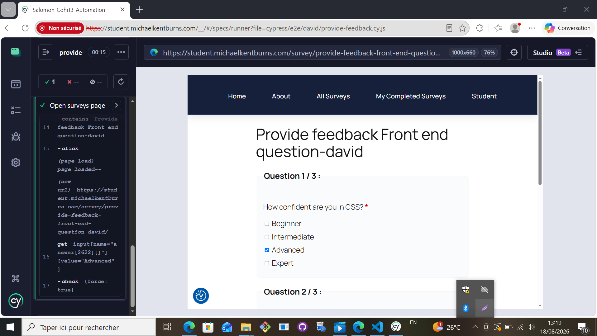
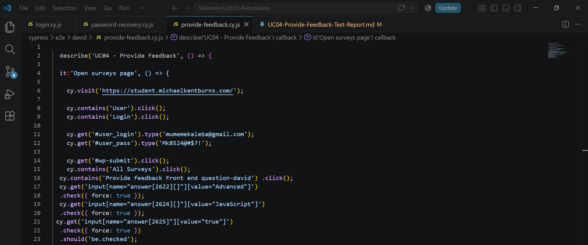
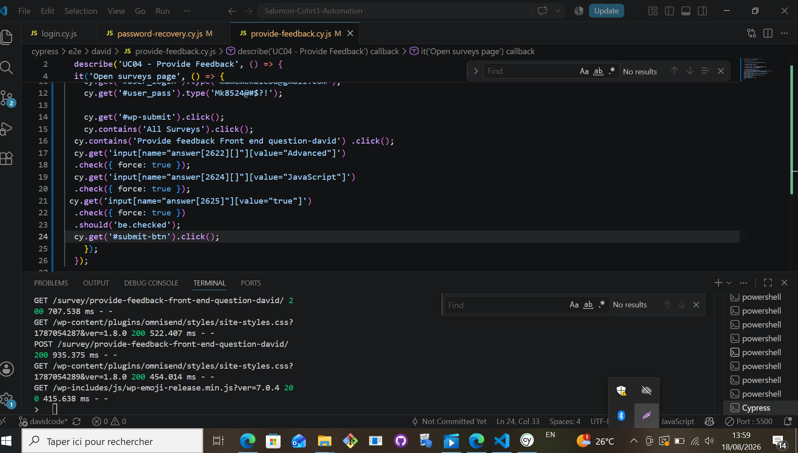
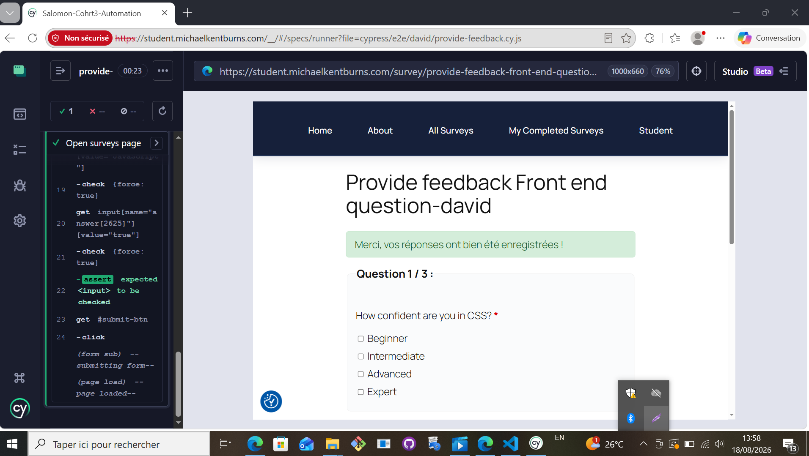

# Provide Feedback Test Execution Report

## Preconditions

Before executing this test, the following conditions were met:

The Student Survey Application was available and accessible.
A valid student account existed in the system.
The student had valid login credentials.
At least one survey was available and assigned to the student.
The student was able to access the login page.

## Context

The purpose of this test was to verify that a student can successfully access, complete, and submit a survey in the Student Survey Application. The test was conducted following the workflow described in the UC04 – Provide Feedback use case.

## Test Execution

### Step 1: Login to the Application

The test began by accessing the application and navigating to the login page through the User menu. Valid student credentials were entered and the login form was submitted.

*** Expected Result:***

The student should be authenticated successfully and redirected to the dashboard.

*** Actual Result:***

The login was successful and the student dashboard was displayed.

Status: PASSED ✅

#### Screeshort :

### Step 2: Verify Dashboard Access 

After authentication, the dashboard page was reviewed to ensure that the student could access the available features and surveys.

*** Expected Result:***

The dashboard should load successfully and display the student interface.

*** Actual Result:***

The dashboard loaded correctly and all expected menu options were visible.

Status: PASSED ✅

### Step 3: Verify Available Surveys

The student checked the list of available surveys assigned to them.

*** Expected Result:***
Available surveys should be displayed on the dashboard.

***Actual Result:***

The survey list was displayed successfully and the assigned survey was available.

#### Screeshort :

 

Status: PASSED ✅

#### Screeshort :
***cypress code***

### Step 4: Open the Survey

The student selected and opened the survey to begin providing feedback.

*** Expected Result: ***
The selected survey should open and display its content.

*** Actual Result: ***
The survey opened successfully without any issues.

Status: PASSED ✅
#### Screeshort : 

*** The cypress code *** 
#### Screeshort : 

### Step 5: Verify Survey Instructions

Before answering the questions, the student reviewed the instructions provided within the survey.

*** Expected Result: ***

Survey instructions should be visible and understandable.

*** Actual Result: ***

The instructions were displayed correctly and were easy to read.
#### Screeshort : 

Status: PASSED ✅

### Step 6: Answer Survey Questions

The student completed all survey questions by selecting the appropriate responses.

*** Expected Result: ***

The system should accept all responses entered by the student.

#### Screeshort :

 

*** Actual Result: ***

All questions were answered successfully and the responses were accepted.

#### Screeshort :

Status: PASSED ✅

### Step 7: Navigate Between Questions

While completing the survey, the student navigated between questions to review and complete responses.

*** Expected Result: ***

Navigation between questions should work correctly without losing responses.

*** Actual Result: ***

The student was able to move through the survey without any issues and all responses remained intact.

Status: PASSED ✅

### Step 8: Submit the Survey

After answering all required questions, the student submitted the survey.

*** Expected Result: ***

The survey should be submitted successfully and the feedback should be stored.

*** Actual Result: ***

The submission was completed successfully without any validation or system errors.

#### Screeshort : 

Status: PASSED ✅

### Step 9: Verify Confirmation Message

After submission, the system displayed a confirmation message.

*** Expected Result: ***

A confirmation message should be displayed to inform the student that the survey was submitted successfully.

*** Actual Result: ***

A confirmation message appeared immediately after submission, confirming that the feedback had been successfully received.

#### Screeshort : 

Status: PASSED ✅

### Conclusion

The UC04 – Provide Feedback use case was executed successfully from start to finish. The student was able to log in, access the dashboard, view available surveys, open a survey, read the instructions, answer all questions, navigate through the survey, and submit feedback without encountering any issues. The system displayed a confirmation message after submission, confirming that the responses had been recorded successfully. Based on the executed test steps, the functionality behaves as expected and meets the requirements defined in the use case.

Final Status: PASSED ✅